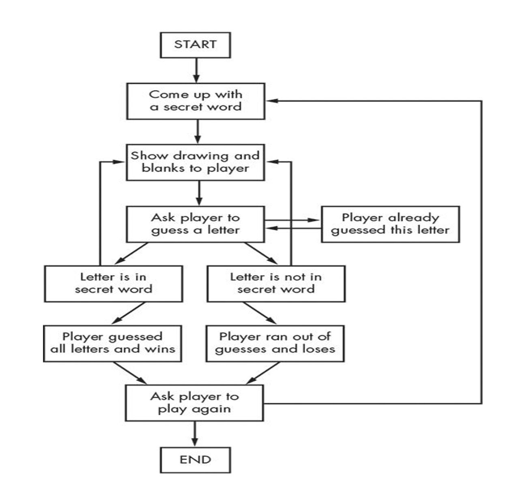
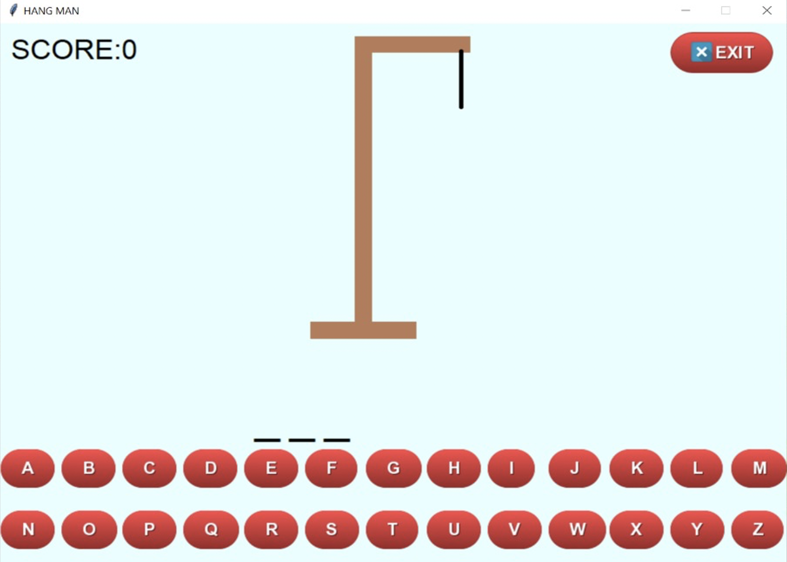
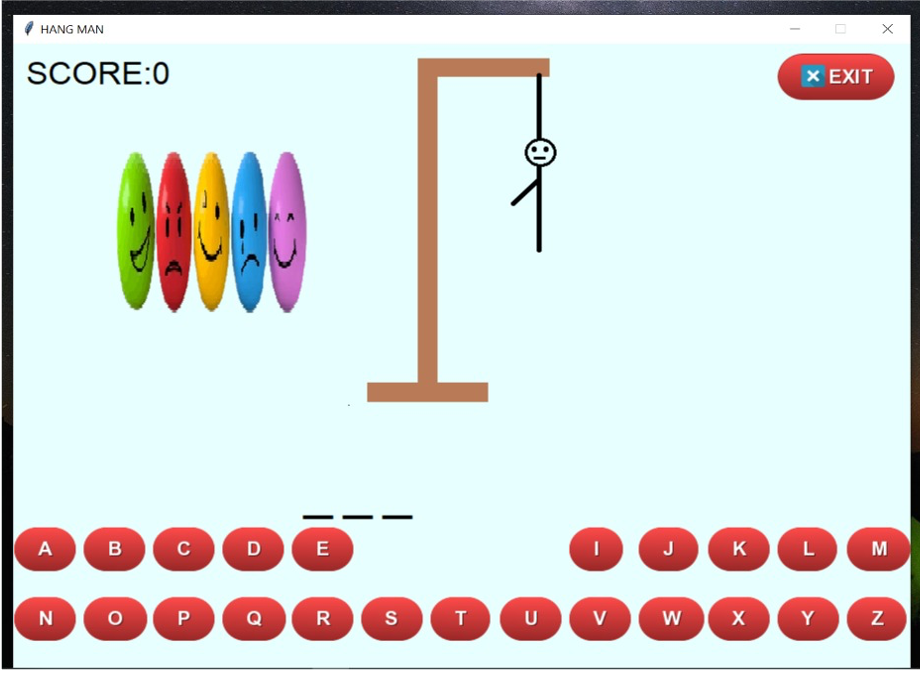
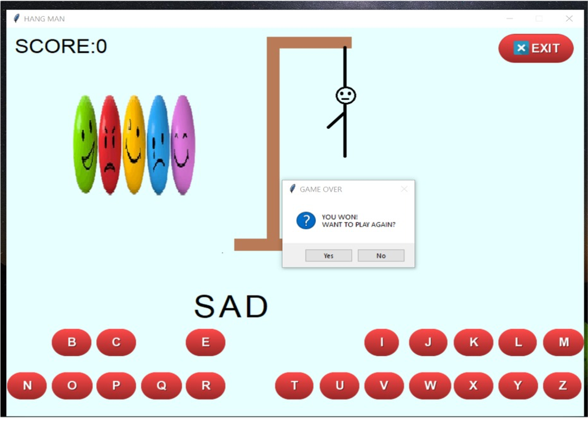
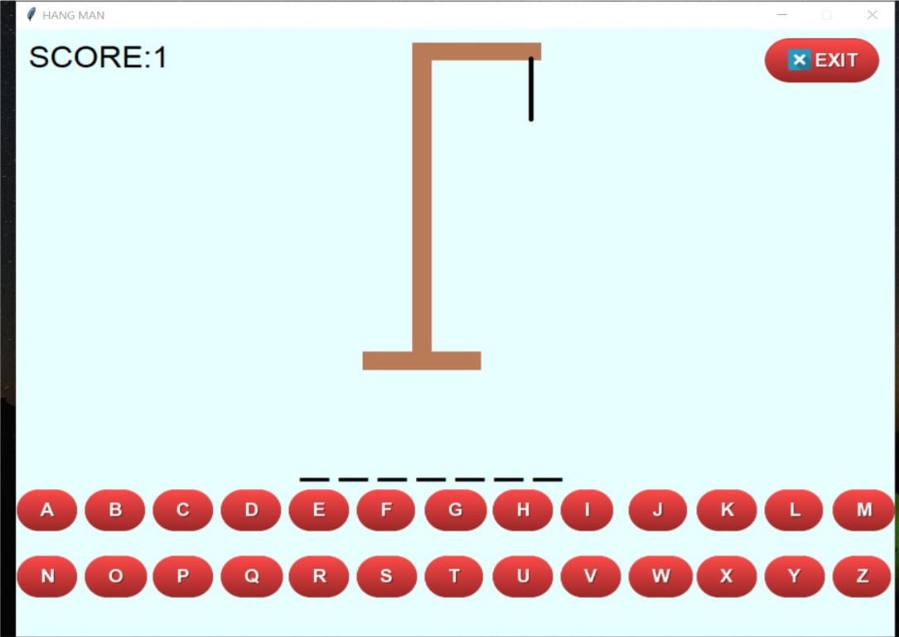

# Hangman Game Using python

## Table of Content

 1. Introduction
 2. Motivation
 3. Learning
 4. Statistics
 5. Approach
 7. Software Technologies-used
 8. Architecture
11. Result and Discussion 
12. Scope

### Overview
Hangman is a paper and pencil guessing game for two or more players. One player(chooser) thinks or choose a secret word and another player(guesser) attempts to guess the word by guessing one letter at a time. 

### Motivation
- Working with GUI Application
- Dealing with Tkinter
- Building efficient code and construction of reliable code
- Updating the game with hint images.
- Displaying the game info on the interface of Hangman.

### Learning

#### Tkinter:- 

- Tkinter is the standard GUI library for Python. Python when combined with Tkinter provides a fast and easy way to create GUI applications. Tkinter provides a powerful object-oriented interface to the Tk GUI toolkit.

- Tkinter provides various controls, such as buttons, labels and text boxes used in a GUI application. These controls are commonly called widgets.

#### messagebox:-

- We imported Messagebox from the Tkinter .
- This module is used to display message boxes in  applications

### Statistics:- 

- Number of lines of code:  125
- Number of Functions: 

We used Four Functions in our Project

- get_word():- It returns two values. One is selected_word and name of the hint.
- instruction():- It displays the pop-up messages about  how to play the game.
- close():- To exit from the game.
- check():-To check if  selected letter is presented in the secret word then it fills the blank dashes with the selected letter or else it will process the hangman to next stage and leaves the dashes blank , blank itself .

### Approach

- The system draws a number of dashes equivalent to the number of letters in the word. 
- If a guessed letter appears in the word, all instances of it are revealed. If not   player loses a chance.
- The player chances are tracked using a stick figure drawing of person being hanged from a gallows. 
- The figure is drawn one body part at a time.
- The player loses when the entire figure has been drawn.
- We used tkinter package for GUI and imported  messagebox from tkinter.
- We placed the data in dictionary format.
- We then created the blank dashes which are equal to length of the random  word
- We gave the different stages of hangman images , the final stage image represents the player’s loss in the game.
- Before reaching the final image of hangman (h7) the word should be guessed by the player to win the game
- We gave A to Z alphabets in buttons format, considering with (X,Y) co-ordinates.
- If you gave three wrong attempt of guesses then hint about the secret word will appear on the screen.

### Software Technologies Used  

- python version 3.10 
- Vs code

### Architecture:

### Result and Discussion

###  Made with &nbsp;❤️ by  [Karan Shah](https://karanshah.tech/) 

